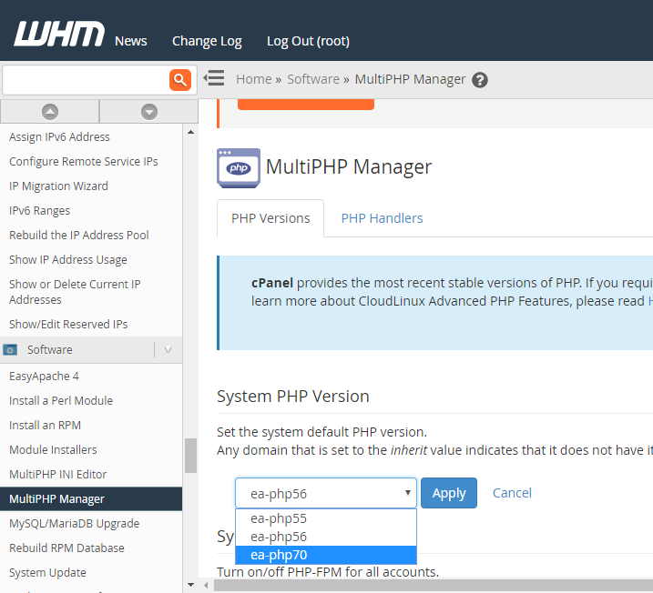
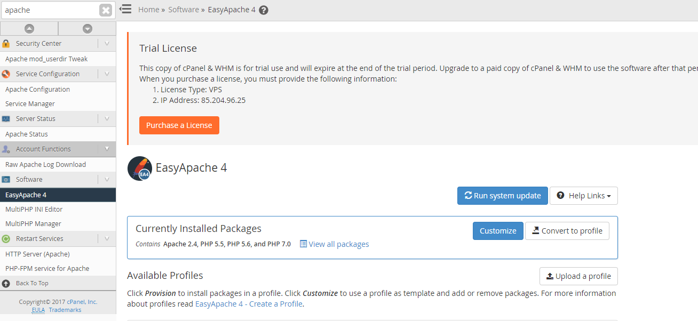
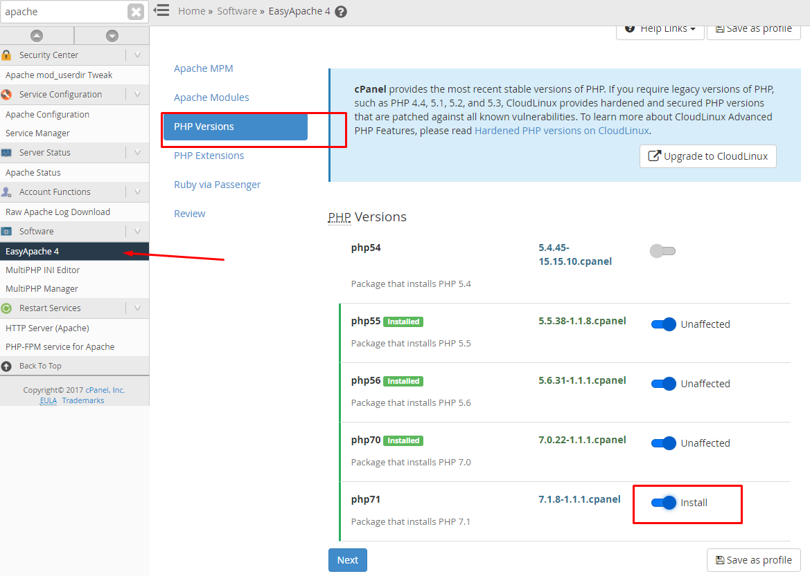
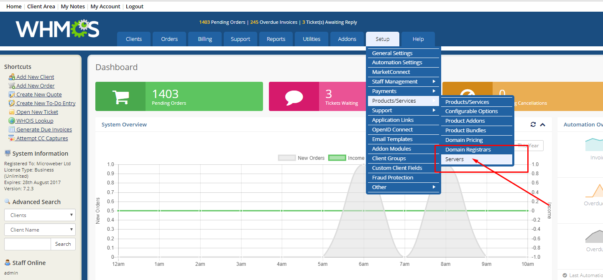
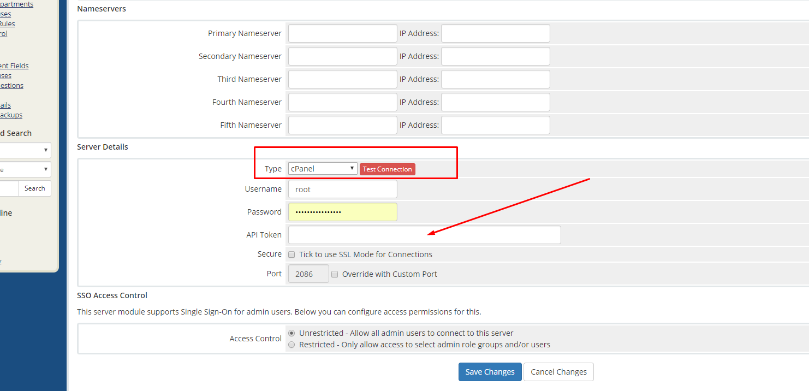
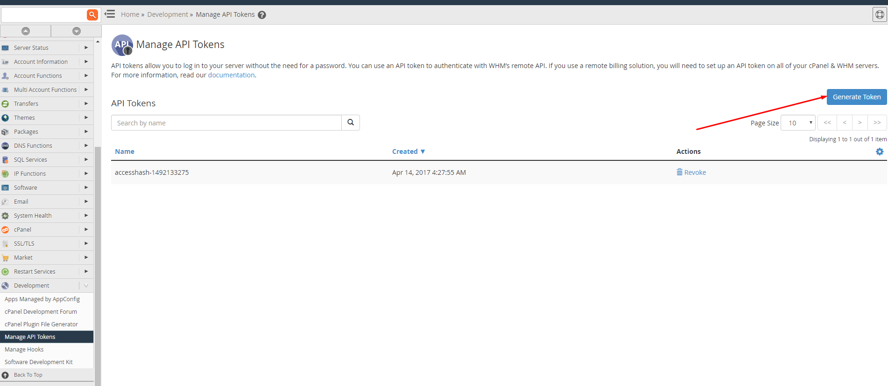
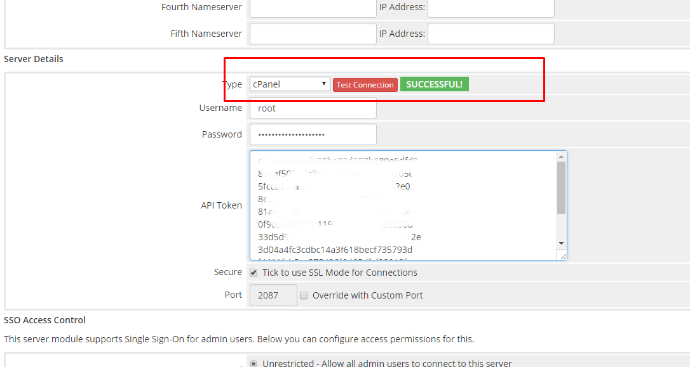

# Microweber cPanel script 

If you are a hosting provider and want to deploy Microweber websites with cPanel accounts, these scripts will help you. 

You will need to have root access to your servers and knowledge of you hosting control panel.


## Setup the WHM/cPanel instance 

 - Install a Linux distribution 
 - Set the hostname of your server with `hostname mydomain.com` aaa
 - Install WHM as described here https://documentation.cpanel.net/display/ALD/Installation+Guide or with command `cd /home && curl -o latest -L https://securedownloads.cpanel.net/latest && sh latest`
 - Set the PHP Version to PHP 7 
 


 - Install the needed PHP extensions, by clicking "Customize" in EasyApache4
 
 
 - Choose php-curl, php-mbstring and php-finfo
 

 
 
 
 And then provision the new settings, after that continue on the next step
 
 
  *Important*
 
  - Setup apache to follow symlinks 
    
    Go to Service Configuration -> Apache Configuration  -> Global ConfigurationDocumentation
    
    and *turn on FollowSymLinks*  and  *turn off SymLinksIfOwnerMatch* 
  
   


## Setup Microweber scripts


Those scripts will install Microweber from a shared folder. All users will load the system files from single location via symlinks
 
The system files are located in the folder `/usr/share/microweber-latest` and if you update this folder it will automatically update all installations of all users on the server 

To setup the Microweber scripts do the following [setup.sh](setup.sh)
 
 - Download the hosing scripts with `wget https://github.com/microweber/microweber-hosting-scripts/archive/master.zip -O /usr/share/microweber-hosting-scripts.zip`
 - Unzip with `unzip /usr/share/microweber-hosting-scripts.zip -d /usr/share/`
 - Rename the unzipped folder `mv /usr/share/microweber-hosting-scripts-master /usr/share/microweber-hosting-scripts`
 - Make files executable `chmod -Rv go+X  /usr/share/microweber-hosting-scripts`
 - Download Microweber with `php /usr/share/microweber-hosting-scripts/common/download.php` 
 - Configure the automatic install by editing the file `/scripts/postwwwacct`  
 
Execute `nano /scripts/postwwwacct` and enter this text 
 
 ```sh
 #!/usr/bin/php -q
 <?php
 
 // Set up our variables to be usable by PHP
 
 if(isset($_SERVER['argv']) and !empty($_SERVER['argv'])){
     $argv = $_SERVER['argv'];
 }
 
 $opts = array();
 $argv0 = array_shift($argv);
 
 while(count($argv)) {
     $key = array_shift($argv);
     $value = array_shift($argv);
     $opts[$key] = $value;
 }

 
 require('/usr/share/microweber-hosting-scripts/cpanel/shared_install.php');
 
 exit();
 
 ```
 
  - Make postwwwacct executable `chmod +x /scripts/postwwwacct` 
  - You are ready!!! 

Here are the setup commands 
 

You can create account from WHM/cPanel and you will see the new website of the user

 
 
## Setup Billing with WHMCS and connect it to cPanel

Go on Setup -> Products/Services -> Servers and add new server 





After that choose cPanel server



Then enter WHM/cPanel by going on the address https://example.com:2087 to get the API Token


Create new API Token



Get the token and paste it in WHMCS 


Test the connection and you should see SUCCESS 




After that you can also create accounts from WHMCS and they will do the installation in cPanel


## Update Microweber

You can update by downloading the new version with
 
`php /usr/share/microweber-hosting-scripts/common/download.php`