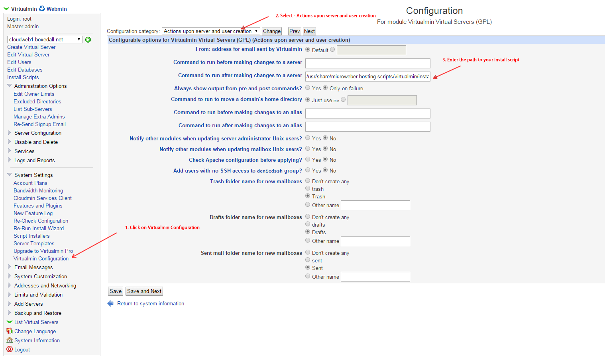

# Hosting scripts for deploying on Virtualmin


Follow those steps to have your Virtualmin server deploy new Microweber installation on new account creation. 

Make sure you cover the [server requirements](https://github.com/microweber/microweber#general-requirements "") and you can install Microweber normally, before employing those automated methods.

## Install Virtualmin

If you haven't installed and setted up Virtualmin, you can do so

Download and run the Vitualmin install script by executing this command 

```sh
wget http://software.virtualmin.com/gpl/scripts/install.sh
chmod +x ./install.sh
./install.sh
```

Install PHP requirements
```
yum install php-mcrypt*
```

## Setup Virtualmin

If you go on http://example.com:10000 you can access the Virtualmin control panel.
Setup your installation and when you are ready can go for the install scripts setup.


## Download latest version of this repository and Microweber

```sh
cd /usr/share/
git clone https://github.com/microweber/microweber-hosting-scripts.git
chmod +x /usr/share/microweber-hosting-scripts/virtualmin/download.php
chmod +x /usr/share/microweber-hosting-scripts/virtualmin/install.php
php /usr/share/microweber-hosting-scripts/virtualmin/download.php

```

## Almost ready

If you have completed the above steps, all that is left is to add the install script as Virtualmin command. The command path is `/usr/share/microweber-hosting-scripts/virtualmin/install.php`



Enter the path to your install script `/usr/share/microweber-hosting-scripts/virtualmin/install.php`


## That's it! 

You are done, its that easy. Now when you create new account from Virtualmin a new Microweber website will be created automatically. 

If you need further configuration you can rename the file `config.dist.php` to `config.php` and edit your settings there. 


